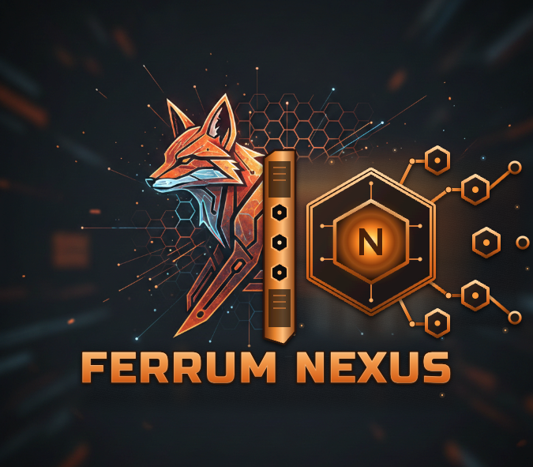
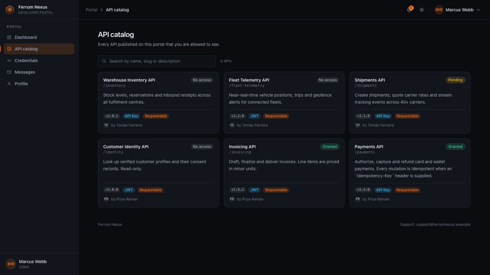
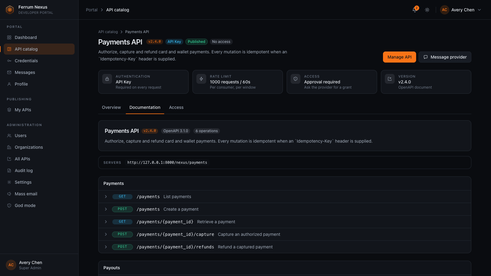
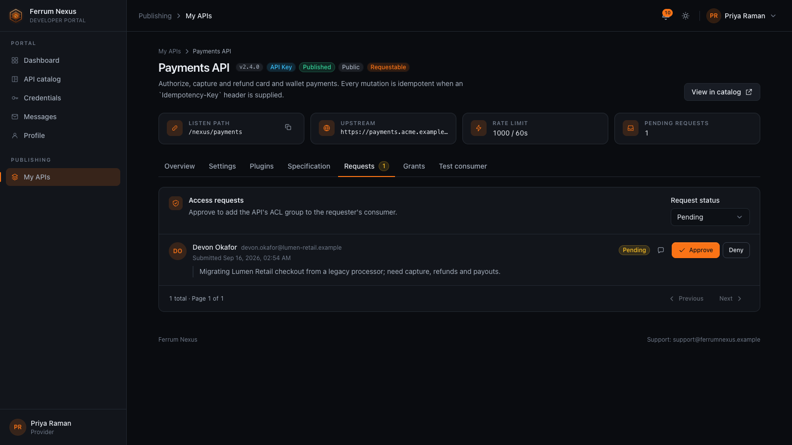
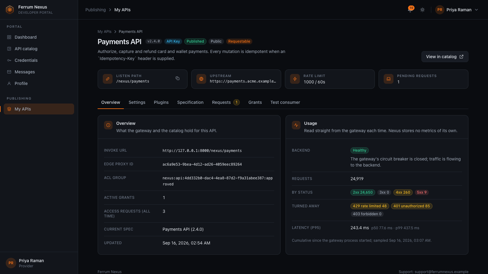
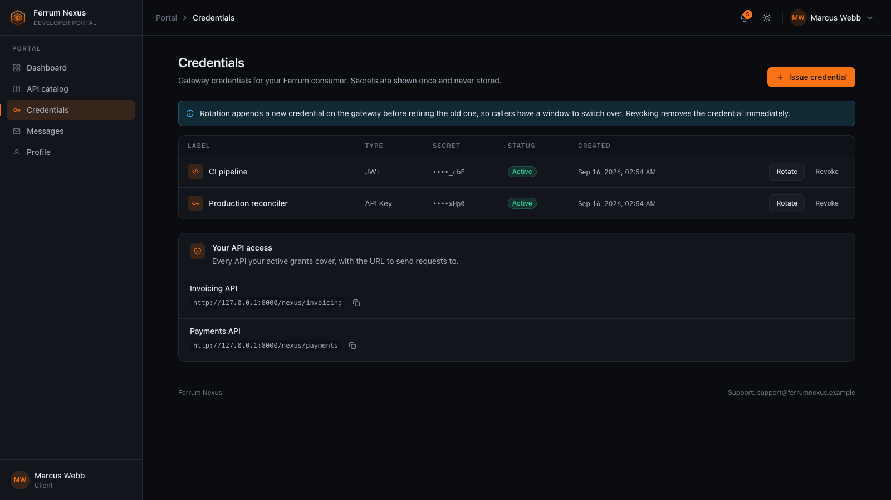
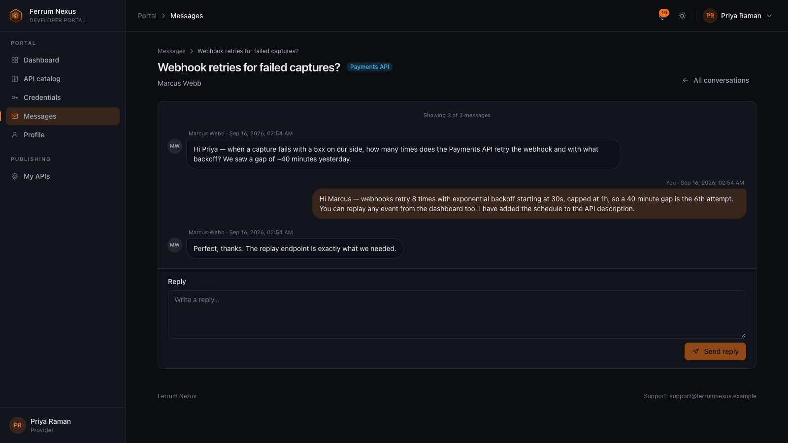
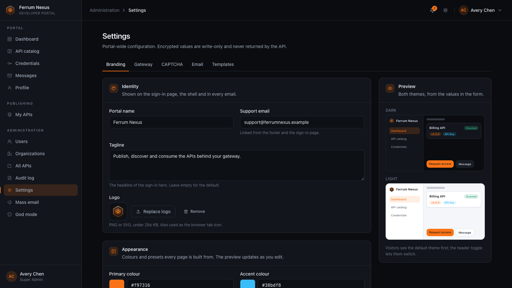

<p align="center">
  
</p>

<h1 align="center">Ferrum Nexus</h1>

<p align="center">
  <a href="https://github.com/ferrum-edge/ferrum-nexus/actions/workflows/ci.yml"></a>
  <a href="https://github.com/ferrum-edge/ferrum-nexus/blob/main/LICENSE"></a>
  
  
</p>

Ferrum Nexus is the multi-user developer portal and workflow layer that sits in
front of [Ferrum Edge](https://github.com/ferrum-edge/ferrum-edge). Ferrum Edge
owns proxies, upstreams, plugins, consumers, credentials, and runtime gateway
behavior. **Ferrum Nexus owns portal accounts, approvals, messaging,
notifications, branding, audit history, request state, and the user-facing API
catalog.**

The browser never talks to the Ferrum Edge Admin API directly — every gateway
mutation goes through the Nexus backend, which enforces RBAC, audit logging,
and per-user authorization before forwarding to Edge.

> Required Notice: Copyright Ferrum Nexus (https://github.com/ferrum-edge)

## Development status

Ferrum Nexus is in active buildout and has not published a supported release yet.
Breaking changes are expected until it does.

- **Development databases.** Schema changes are still folded into one `001_initial`
  baseline per backend. When it changes, recreate your disposable development
  database — see the [development reset](docs/operations.md#buildout-schema-policy).
  Never apply that reset to a database you need to keep.
- **Production upgrades.** The first supported release freezes that baseline. From
  then on, schema changes ship as forward migrations that upgrade a released
  database in place, CI rejects edits to released migrations, and upgrades never
  require a reset — see
  [schema versioning and upgrades](docs/operations.md#schema-versioning-and-upgrades)
  and [backup and restore](docs/operations.md#5-backup-and-restore). No version has a
  supported upgrade path before that release.

## Features

- **API clients** can register, verify their email (and re-send the link),
  reset a forgotten password, manage contact info, create and rotate
  gateway credentials, browse the API catalog with rendered OpenAPI docs,
  request access with a justification, message providers, and receive
  email + in-app notifications.
- **API providers** can publish OpenAPI specs (which create Ferrum Edge
  proxies), choose whether an API is externally requestable, review and
  approve / deny / revoke access requests, edit safe runtime settings (rate
  limits, auth plugin selection, access policy, browser CORS policy, the
  upstream), message clients, and create test consumers for their own APIs.
- **Portal admins** can configure CAPTCHA, branding, email senders and
  templates, send mass emails, manage users / providers / APIs / grants,
  view a historical audit log, and use **god mode** for emergency revoke,
  spec deletion, user disablement, and direct platform messaging.
- **Ferrum integration** uses one Ferrum consumer per _identity_ per namespace:
  a client account (`nexus-user-<id>`), or one of its **applications**
  (`nexus-app-<id>`). Approvals add an `acl_group`
  (`nexus:api:<api_id>:approved`) to that consumer; revocations remove it. Each
  requestable API gets an `access_control` plugin that allows only that group.
- **Applications** let one account keep its integrations apart: each has its own
  approved APIs and its own credentials, and because the boundary is the Edge
  consumer, two applications of one owner approved for different APIs cannot
  call each other's. Account-scoped access is unchanged and remains the
  default.

## Screenshots

Captured from a portal seeded with demo data, running against a mock Ferrum
Edge Admin API. Dark theme; a light theme ships too.

<p align="center">
  
</p>

<table>
  <tr>
    <td width="50%" valign="top">
      
      <sub><b>Rendered OpenAPI docs</b> — every operation, parameter and schema, straight from the published spec, with the invoke URL beside it.</sub>
    </td>
    <td width="50%" valign="top">
      
      <sub><b>Access requests</b> — providers approve or deny with a note; an approval becomes an ACL grant on the gateway consumer.</sub>
    </td>
  </tr>
  <tr>
    <td width="50%" valign="top">
      
      <sub><b>Provider overview</b> — the configured listen path, upstream and rate limit beside usage read straight from the gateway; Nexus stores no metrics of its own.</sub>
    </td>
    <td width="50%" valign="top">
      
      <sub><b>Credentials</b> — show-once API keys, basic auth and JWT secrets that clients issue, rotate and revoke themselves; a rotation returns the new secret once and retires the old one in the same operation.</sub>
    </td>
  </tr>
  <tr>
    <td width="50%" valign="top">
      
      <sub><b>Messaging</b> — client ↔ provider threads tied to an API, platform threads with the admins, bell notifications and broadcasts.</sub>
    </td>
    <td width="50%" valign="top">
      
      <sub><b>White-label branding</b> — portal name, logo, colours, typeface, radius and sidebar style, with the portal shell previewed in both themes as you edit; the sign-in layout is configurable too.</sub>
    </td>
  </tr>
</table>

## Architecture

```
Browser
  |
  | HTTPS (same-origin)
  v
Ferrum Nexus SPA (web/)
  |
  | Session cookie + CSRF
  v
Ferrum Nexus BFF (server/)  -->  SMTP / Email provider
  |                          \-> Nexus DB (PG / MySQL / SQLite / Mongo)
  |
  +--> Ferrum Edge Admin API (server-side only, JWT-protected)
```

See [`docs/architecture.md`](docs/architecture.md) for the full design.

## Quickstart

```bash
# Requires Node.js 22.14+ (see .nvmrc)
npm install

cp .env.example .env
# edit .env — at minimum set NEXUS_SECRET_KEY and FERRUM_ADMIN_JWT_SECRET
# (both at least 32 characters; FERRUM_ADMIN_URL defaults to http://127.0.0.1:9000)

npm run migrate   # builds shared, then initializes the schema
npm run dev
```

Both commands read the root `.env` (looked up in the working directory and its
parent, so the workspace scripts find it too). Anything already exported in the
shell wins over the file, and a deployed image with no `.env` is unaffected.
A relative `NEXUS_SQLITE_PATH` resolves from `server/`, where the workspace
scripts run.

Open <http://127.0.0.1:5173>. The backend serves on `http://127.0.0.1:8787`.

Those are the defaults. The Vite half reads the same repo-root `.env` as the
BFF: `NEXUS_WEB_PORT` (alias `VITE_DEV_PORT`) is the SPA listen port, and
`/api` is proxied to `NEXUS_API_PROXY_TARGET` or, when that is unset, to
`http://127.0.0.1:<NEXUS_PORT>` (`NEXUS_PORT` is the existing API bind port).
A taken port fails the Vite process instead of silently moving to the next
one. Invalid values fail with the variable name in the error.

To run a second clone beside a stack that already holds 5173/8787, point that
checkout's `.env` at a free pair and a separate SQLite file:

```bash
NEXUS_PORT=8788
NEXUS_WEB_PORT=5175
NEXUS_PUBLIC_URL=http://127.0.0.1:5175
NEXUS_SQLITE_PATH=./data/nexus-b.sqlite
```

Give the second stack its own Edge namespace and gateway ports too if it is
not sharing the first gateway.

The first user to register becomes the initial `super_admin`, so that one
registration has to prove it comes from you: while the portal has no super
admin the sign-up form asks for a **bootstrap token**. Set
`NEXUS_BOOTSTRAP_TOKEN` yourself, or leave it blank and copy the token the
server prints at startup:

```
FIRST-RUN BOOTSTRAP: this portal has no super_admin yet.
...
    2f6c1b…  ← paste this into the form's "Bootstrap token" field
```

The generated token lives for the life of that process and differs per
instance, so pin `NEXUS_BOOTSTRAP_TOKEN` for anything running more than one.

### Locked out by CAPTCHA

CAPTCHA is configured in **Admin → Settings** and fails closed, so a wrong site
key or an unreachable vendor refuses every password login, the super admin's
included. Saving an activation therefore requires solving the challenge in that
settings page first — the portal verifies the token with the vendor before it
stores the configuration. If a portal is stuck anyway (the vendor broke after
the fact, say), start the server with `NEXUS_CAPTCHA_ENFORCEMENT=disabled`,
which makes sign-in and registration skip the challenge without changing a
stored setting, fix the configuration, then remove the variable and restart.
Every session admitted that way is audited, and the running server says so at
startup. Full runbook:
[`docs/operations.md`](docs/operations.md#recovering-a-portal-locked-out-by-captcha).

## Database

Ferrum Nexus uses string UUIDs across all databases so PostgreSQL, MySQL,
SQLite, and MongoDB share the same logical schema.

```bash
# choose with NEXUS_DB_DRIVER in .env
NEXUS_DB_DRIVER=sqlite      # default; file at ./data/nexus.sqlite
NEXUS_DB_DRIVER=postgres    # NEXUS_DB_URL=postgres://...
NEXUS_DB_DRIVER=mysql       # NEXUS_DB_URL=mysql://...
NEXUS_DB_DRIVER=mongodb     # NEXUS_DB_URL=mongodb+srv://...
```

> Note: with MongoDB, multi-document workflows require a replica set for
> transactional atomicity. See [`docs/operations.md`](docs/operations.md).

## Docker

```bash
docker build -t ferrum-nexus -f docker/Dockerfile .
# FERRUM_ADMIN_JWT_SECRET must match the gateway's own value, and both
# secrets must be at least 32 characters or the server refuses to start.
# The container binds 0.0.0.0, so publish the port on loopback (as below)
# rather than `-p 8787:8787`, which would offer it on every host interface.
docker run --rm -p 127.0.0.1:8787:8787 \
  -e NEXUS_SECRET_KEY=$(openssl rand -hex 32) \
  -e FERRUM_ADMIN_URL=http://host.docker.internal:9000 \
  -e FERRUM_ADMIN_JWT_SECRET="$FERRUM_ADMIN_JWT_SECRET" \
  ferrum-nexus
```

The bootstrap token is printed to the container log
(`docker logs`); pass `-e NEXUS_BOOTSTRAP_TOKEN=…` to choose it instead.

For a full stack alongside Postgres and a Ferrum Edge instance, use the
[compatibility record](release/compatibility.env) from this checkout. It selects
the published Edge v0.9.5 image by digest, the same image selected by CI. The
Nexus image is built from this checkout; once a Nexus version tag is published,
check out that tag before running these commands. See the
[draft release notes](docs/release-notes.md) for the release boundary.

The four secrets and the Edge image are required. Keep the secrets stable for
the life of the stack; save them in a secret manager rather than generating new
ones when restarting it. Run from the repository root:

<!-- compose-quickstart:start -->

```bash
cp docker/docker-compose.example.yml docker-compose.yml
set -a
. ./release/compatibility.env
set +a
export NEXUS_SECRET_KEY=$(openssl rand -hex 32)
export NEXUS_DB_PASSWORD=$(openssl rand -hex 16)
export FERRUM_ADMIN_JWT_SECRET=$(openssl rand -hex 32)
export FERRUM_BASIC_AUTH_HMAC_SECRET=$(openssl rand -hex 32)
docker compose up -d
```

<!-- compose-quickstart:end -->

The portal is at <http://127.0.0.1:8787>. `docker compose logs nexus` shows
the first-run bootstrap token. For retained data, TLS, backup and restore, and
the supported single-active-writer model, read
[operations](docs/operations.md). This checkout is still a buildout snapshot;
the release tag and production upgrade contract are pending. Follow the
[getting-started walkthrough](docs/getting-started.md) to register, publish an
API, and make an authenticated request through Edge.

## Documentation

Start here:

- [`docs/getting-started.md`](docs/getting-started.md) — end-to-end walkthrough:
  stand up a gateway, publish an API, approve access, and call it with an
  issued credential.

Guides by role:

- [`docs/guides/client-guide.md`](docs/guides/client-guide.md) — consuming APIs.
- [`docs/guides/provider-guide.md`](docs/guides/provider-guide.md) — publishing
  APIs and reviewing access requests.
- [`docs/guides/admin-guide.md`](docs/guides/admin-guide.md) — running the
  portal.

Reference:

- [`docs/architecture.md`](docs/architecture.md) — design rationale, module
  layout, and trust boundaries.
- [`docs/api.md`](docs/api.md) — Nexus backend REST API reference.
- [`docs/operations.md`](docs/operations.md) — running, scaling, backup,
  key rotation, and observability.
- [`docs/security.md`](docs/security.md) — threat model and hardening.
- [`docs/contributing.md`](docs/contributing.md) → [`CONTRIBUTING.md`](CONTRIBUTING.md)

## License

Ferrum Nexus is dual-licensed:

- [PolyForm Noncommercial 1.0.0](LICENSE) for personal, research,
  educational, and nonprofit use.
- [Commercial License](LICENSE-COMMERCIAL.md) for commercial use.

See [`SECURITY.md`](SECURITY.md) to report security issues.
