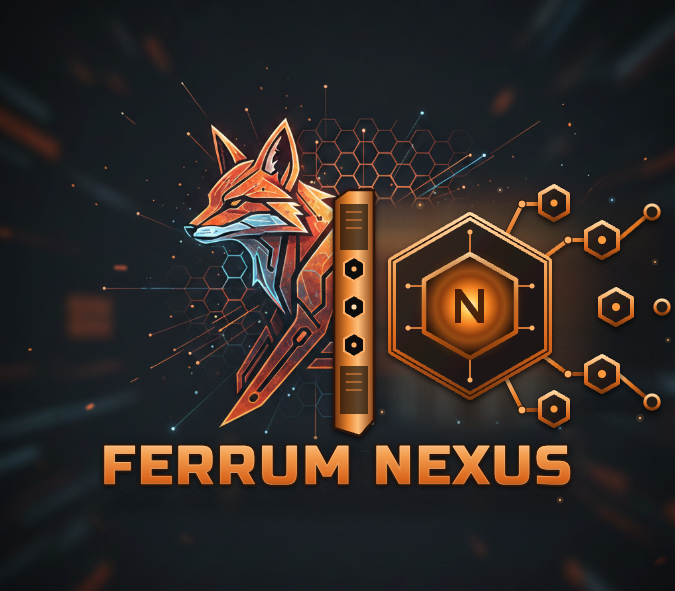
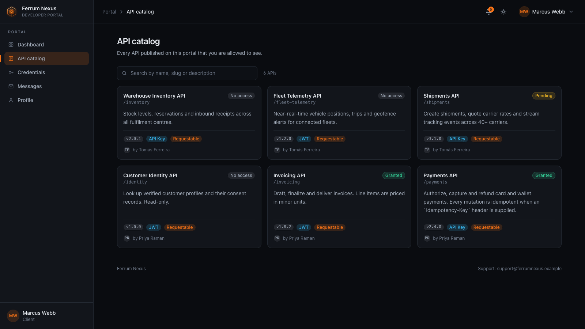
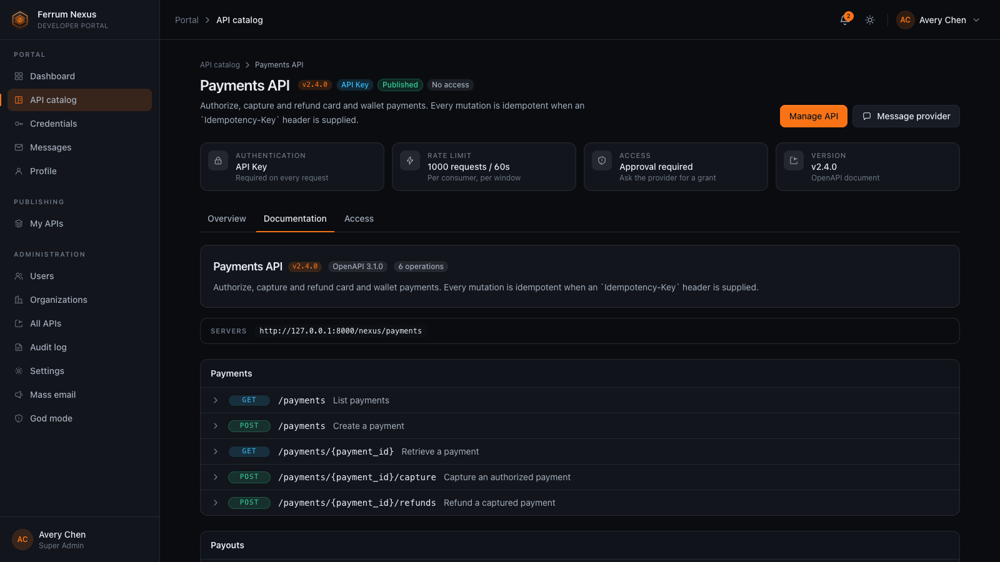
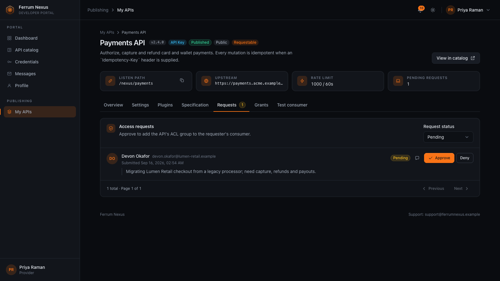
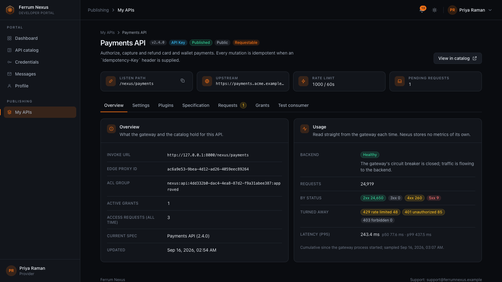
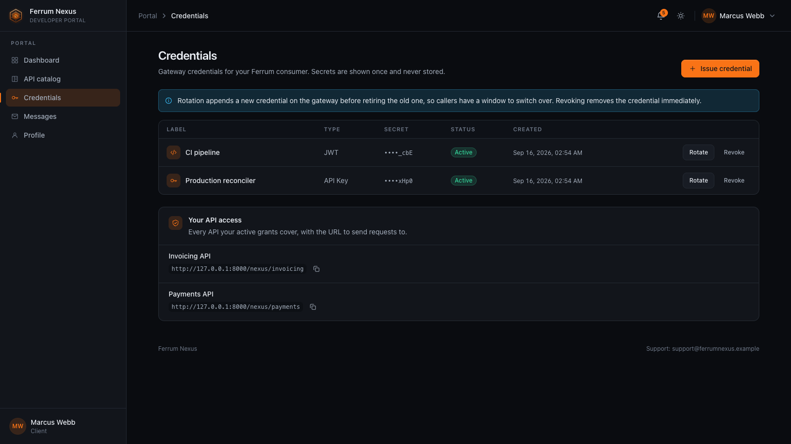
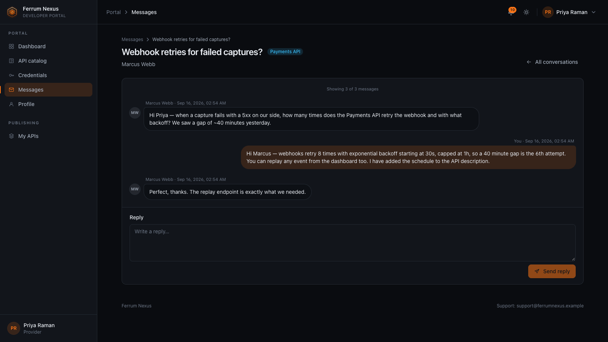
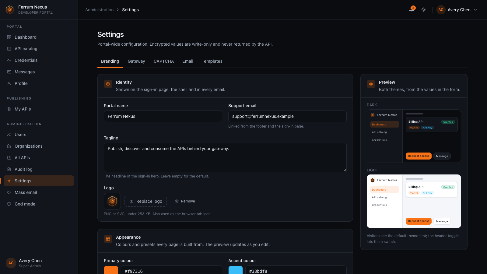

<p align="center">
  
</p>

<h1 align="center">Ferrum Nexus</h1>

<p align="center">
  <a href="https://github.com/ferrum-edge/ferrum-nexus/actions/workflows/ci.yml"></a>
  <a href="https://github.com/ferrum-edge/ferrum-nexus/blob/main/LICENSE"></a>
  
  
</p>

Ferrum Nexus is the multi-user developer portal in front of
[Ferrum Edge](https://github.com/ferrum-edge/ferrum-edge).

- **Ferrum Edge** owns proxies, upstreams, plugins, consumers, credentials and
  runtime gateway behavior.
- **Ferrum Nexus** owns portal accounts, approvals, messaging, notifications,
  branding, audit history, request state and the API catalog.

The browser never calls the Ferrum Edge Admin API. Every gateway change goes
through the Nexus backend, which checks roles and ownership and writes an audit
row before calling Edge.

> Required Notice: Copyright Ferrum Nexus (https://github.com/ferrum-edge)

## Development status

`v0.3.0` is the current release, paired with Ferrum Edge `v0.9.9`; `v0.1.0` was
the first supported release. The [release notes](docs/release-notes.md) list the
supported pair, how to upgrade from `v0.2.0`, and the known limitations.

The owner has approved jsdom 30.1.2 / Undici 8.11.2 and the current unreleased
supported Node range `^22.22.2 || ^24.15.0 || >=26.0.0`. Node 22 remains supported;
older Node 22/24 patches and Node 23/25 are excluded. Published releases retain
their historical Node 22.14+ profile until a new release ships.

- **Production upgrades.** Schema changes ship as forward migrations that
  upgrade a released database in place; upgrades never require a reset. See
  [schema versioning and upgrades](docs/operations.md#schema-versioning-and-upgrades)
  and [backup and restore](docs/operations.md#5-backup-and-restore).
- **Development databases.** A disposable database created before `v0.1.0` must
  be recreated with the [development reset](docs/operations.md#buildout-schema-policy).
  Never apply that reset to a database you need to keep.

## Features

- **API clients** register, verify their email, reset a forgotten password,
  browse the catalog with rendered OpenAPI docs, request access with a
  justification, issue and rotate gateway credentials, message providers, and
  get email and in-app notifications.
- **API providers** publish OpenAPI specs (each one becomes a Ferrum Edge
  proxy), choose whether an API needs an access request, approve, deny or
  revoke access, edit runtime settings (rate limit, auth plugin, access policy,
  CORS, upstream), message clients, and create test consumers for their own
  APIs.
- **Portal admins** configure CAPTCHA, branding, email and templates, send mass
  email, manage users, APIs and grants, read the audit log, and use **god
  mode** to revoke a grant, delete an API, disable a user or broadcast to users.
- **Gateway mapping.** Each identity gets one Ferrum consumer: an account
  (`nexus-user-<id>`) or one of its **applications** (`nexus-app-<id>`). An
  approval adds the ACL group `nexus:api:<api_id>:approved` to that consumer
  and a revocation removes it. Each requestable API has an `access_control`
  plugin that allows only that group.
- **Applications** keep one account's integrations apart. Each has its own
  approved APIs and credentials, so two applications of the same owner cannot
  call each other's APIs. Account-level access remains the default.

## Screenshots

Captured from a portal seeded with demo data, running against a mock Ferrum
Edge Admin API. Dark theme; a light theme ships too.

<p align="center">
  
</p>

<table>
  <tr>
    <td width="50%" valign="top">
      
      <sub><b>Rendered OpenAPI docs</b> — every operation, parameter and schema, straight from the published spec, with the invoke URL beside it.</sub>
    </td>
    <td width="50%" valign="top">
      
      <sub><b>Access requests</b> — providers approve or deny with a note; an approval becomes an ACL grant on the gateway consumer.</sub>
    </td>
  </tr>
  <tr>
    <td width="50%" valign="top">
      
      <sub><b>Provider overview</b> — the configured listen path, upstream and rate limit beside usage read straight from the gateway; Nexus stores no metrics of its own.</sub>
    </td>
    <td width="50%" valign="top">
      
      <sub><b>Credentials</b> — show-once API keys, basic auth and JWT secrets that clients issue, rotate and revoke themselves; a rotation returns the new secret once and retires the old one in the same operation.</sub>
    </td>
  </tr>
  <tr>
    <td width="50%" valign="top">
      
      <sub><b>Messaging</b> — client ↔ provider threads tied to an API, platform threads with the admins, bell notifications and broadcasts.</sub>
    </td>
    <td width="50%" valign="top">
      
      <sub><b>White-label branding</b> — portal name, logo, colours, typeface, radius and sidebar style, with the portal shell previewed in both themes as you edit; the sign-in layout is configurable too.</sub>
    </td>
  </tr>
</table>

## Architecture

```
Browser
  |
  | HTTPS (same-origin)
  v
Ferrum Nexus SPA (web/)
  |
  | Session cookie + CSRF
  v
Ferrum Nexus BFF (server/)  -->  SMTP / Email provider
  |                          \-> Nexus DB (PG / MySQL / SQLite / Mongo)
  |
  +--> Ferrum Edge Admin API (server-side only, JWT-protected)
```

See [`docs/architecture.md`](docs/architecture.md) for the full design.

## Quickstart

```bash
# Unreleased source: Node ^22.22.2 || ^24.15.0 || >=26.0.0 (see .nvmrc)
npm install

cp .env.example .env
# edit .env — at minimum set NEXUS_SECRET_KEY and FERRUM_ADMIN_JWT_SECRET
# (both at least 32 characters; FERRUM_ADMIN_URL defaults to http://127.0.0.1:9000)

npm run migrate   # builds shared, then migrates the database
npm run dev       # backend :8787, web :5173
```

Open <http://127.0.0.1:5173>. The backend listens on `http://127.0.0.1:8787`.

- Both commands read the repo-root `.env`. Variables already exported in the
  shell win over the file.
- A relative `NEXUS_SQLITE_PATH` resolves from `server/`, where the workspace
  scripts run, so the default database is `server/data/nexus.sqlite`.
- The Vite dev server listens on `NEXUS_WEB_PORT` (alias `VITE_DEV_PORT`) and
  proxies `/api` to `NEXUS_API_PROXY_TARGET`, or to `NEXUS_PORT` when that is
  unset. A port that is already taken fails the start instead of moving to the
  next free one.

To run a second clone beside a stack that already holds 5173/8787, give that
checkout's `.env` its own ports and SQLite file:

```bash
NEXUS_PORT=8788
NEXUS_WEB_PORT=5175
NEXUS_PUBLIC_URL=http://127.0.0.1:5175
NEXUS_SQLITE_PATH=./data/nexus-b.sqlite
```

If the second stack does not share the first gateway, give it its own Edge
namespace and gateway ports too.

The first account to register becomes the `super_admin`. While the portal has
no active super admin, registration requires a **bootstrap token**. Set
`NEXUS_BOOTSTRAP_TOKEN` (at least 16 characters), or leave it blank and copy
the token the server prints at startup:

```
FIRST-RUN BOOTSTRAP: this portal has no super_admin yet.
...
    2f6c1b…  ← paste this into the form's "Bootstrap token" field
```

A generated token changes on every restart and differs per instance, so set
`NEXUS_BOOTSTRAP_TOKEN` when you run more than one instance.

### Locked out by CAPTCHA

CAPTCHA is configured in **Administration → Settings** and fails closed: a
wrong site key or an unreachable vendor blocks every password login, including
the super admin's. To prevent that, saving a CAPTCHA configuration requires
solving its challenge first.

If a portal is stuck anyway, restart the server with
`NEXUS_CAPTCHA_ENFORCEMENT=disabled`. Sign-in and registration then skip the
challenge without changing the stored setting. Fix the configuration, remove
the variable and restart. The server prints a banner at startup while the
variable is set, and every session it admits is audited. Full runbook:
[`docs/operations.md`](docs/operations.md#recovering-a-portal-locked-out-by-captcha).

## Database

PostgreSQL, MySQL, SQLite and MongoDB share one logical schema with string
UUID keys. Choose the driver in `.env`:

```bash
NEXUS_DB_DRIVER=sqlite      # default; NEXUS_SQLITE_PATH=./data/nexus.sqlite
NEXUS_DB_DRIVER=postgres    # NEXUS_DB_URL=postgres://...
NEXUS_DB_DRIVER=mysql       # NEXUS_DB_URL=mysql://...
NEXUS_DB_DRIVER=mongodb     # NEXUS_DB_URL=mongodb+srv://...
```

MongoDB must be a replica set: Nexus needs multi-document transactions and
refuses to start against a standalone server unless
`NEXUS_DB_ALLOW_STANDALONE=true` (development only). See
[`docs/operations.md`](docs/operations.md).

## Docker

```bash
docker build -t ferrum-nexus -f docker/Dockerfile .
docker run --rm -p 127.0.0.1:8787:8787 \
  --add-host=host.docker.internal:host-gateway \
  -e NEXUS_SECRET_KEY=$(openssl rand -hex 32) \
  -e NEXUS_PUBLIC_URL=http://127.0.0.1:8787 \
  -e NEXUS_COOKIE_SECURE=false \
  -e FERRUM_ADMIN_URL=http://host.docker.internal:9000 \
  -e FERRUM_ADMIN_ALLOW_INSECURE_HTTP=true \
  -e FERRUM_ADMIN_JWT_SECRET="$FERRUM_ADMIN_JWT_SECRET" \
  ferrum-nexus
```

- Both secrets must be at least 32 characters, and `FERRUM_ADMIN_JWT_SECRET`
  must match the gateway's, or the server refuses to start.
- `FERRUM_ADMIN_ALLOW_INSECURE_HTTP=true` is required for a plain `http://`
  Admin API URL on any host other than loopback.
- `NEXUS_COOKIE_SECURE=false` is for plain-http local use only. Behind TLS,
  set `NEXUS_PUBLIC_URL` to the `https://` origin and drop it.
- The container listens on `0.0.0.0`, so publish the port on loopback as shown
  rather than `-p 8787:8787`, which exposes it on every host interface.
- Without a volume on `/app/data`, the SQLite database is lost with the
  container.

The bootstrap token is printed to the container log (`docker logs`). Pass
`-e NEXUS_BOOTSTRAP_TOKEN=…` to choose it instead.

### Full stack with Compose

The Compose example runs Nexus, PostgreSQL and Ferrum Edge. The
[compatibility record](release/compatibility.env) now selects the published Edge `v0.9.13`
default image by digest for this draft candidate. Exact-head hosted qualification
remains required; see [adoption status](docs/edge-0.9.11-adoption.md). The Nexus
image is built from your checkout. For the released combination, check out
`v0.3.0` and use that tag's compatibility record. This branch's v0.9.13 pin
belongs to the unreleased candidate, which pairs with Edge v0.9.13 only.

The four secrets and the Edge image are required. Keep the secrets stable for
the life of the stack: store them in a secret manager instead of generating new
ones on restart. Run from the repository root. The
[verbatim quickstart gate](docs/release-notes.md#release-step) runs this exact
block in a clean runner for every release tag:

<!-- compose-quickstart:start -->

```bash
cp docker/docker-compose.example.yml docker-compose.yml
set -a
. ./release/compatibility.env
set +a
export NEXUS_SECRET_KEY=$(openssl rand -hex 32)
export NEXUS_DB_PASSWORD=$(openssl rand -hex 16)
export FERRUM_ADMIN_JWT_SECRET=$(openssl rand -hex 32)
export FERRUM_BASIC_AUTH_HMAC_SECRET=$(openssl rand -hex 32)
docker compose up -d
```

<!-- compose-quickstart:end -->

The portal is at <http://127.0.0.1:8787> and the gateway's proxy listener at
<http://127.0.0.1:8000>. `docker compose logs nexus` shows the bootstrap token.
Next, follow the [getting-started walkthrough](docs/getting-started.md) to
publish an API and call it through Edge. Before production, read
[operations](docs/operations.md) for TLS, backups, upgrades and the
single-active-writer model.

## Contracts

Cross-repo contracts — shared vocabularies, JSON schemas and fixtures — live in the org
[ferrum-contracts](https://github.com/ferrum-edge/ferrum-contracts) store. Nexus vendors the
Ferrum Edge vocabularies it speaks under
[`contracts/ferrum-contracts/`](contracts/ferrum-contracts/), pinned by tag
(`contracts-edge-0.9.13`) and per-file SHA-256 in
[`contracts/ferrum-contracts/PIN`](contracts/ferrum-contracts/PIN). The `shared` contract test
verifies every digest and checks Nexus's local names against the vendored vocabularies; the
vendoring and bump procedure is in [`CONTRIBUTING.md`](CONTRIBUTING.md). The unreleased
[service-manifest preview](docs/service-manifest-preview.md) separately pins its EXISTING shared v1
schema and fixtures to `contracts-edge-0.9.13`, commit
`9626821eb089c71f5d4d71268c7b8276a8a5ab50`, in
[`contracts/ferrum-contracts/SERVICE-MANIFEST-PIN`](contracts/ferrum-contracts/SERVICE-MANIFEST-PIN).
Alloy owner code remains unreleased; the preview remains read-only. A shared contract changes
in ferrum-contracts first and is then re-vendored here — never edited locally.

## Documentation

Start here:

- [`docs/getting-started.md`](docs/getting-started.md) — end-to-end walkthrough:
  stand up a gateway, publish an API, approve access, and call it with an
  issued credential.

Guides by role:

- [`docs/guides/client-guide.md`](docs/guides/client-guide.md) — consuming APIs.
- [`docs/guides/provider-guide.md`](docs/guides/provider-guide.md) — publishing
  APIs and reviewing access requests.
- [`docs/guides/admin-guide.md`](docs/guides/admin-guide.md) — running the
  portal.

Reference:

- [`docs/architecture.md`](docs/architecture.md) — design rationale, module
  layout, and trust boundaries.
- [`docs/api.md`](docs/api.md) — Nexus backend REST API reference.
- [`docs/operations.md`](docs/operations.md) — running, scaling, backup,
  key rotation, and observability.
- [`docs/security.md`](docs/security.md) — threat model and hardening.
- [`docs/contributing.md`](docs/contributing.md) → [`CONTRIBUTING.md`](CONTRIBUTING.md)

## License

Ferrum Nexus is dual-licensed:

- [PolyForm Noncommercial 1.0.0](LICENSE) for personal, research,
  educational, and nonprofit use.
- [Commercial License](LICENSE-COMMERCIAL.md) for commercial use.

See [`SECURITY.md`](SECURITY.md) to report security issues.
